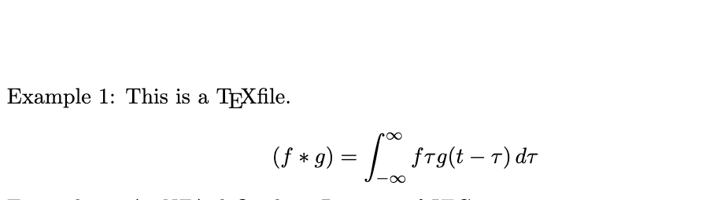
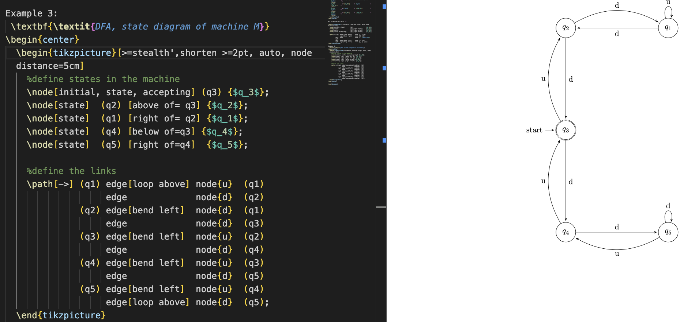
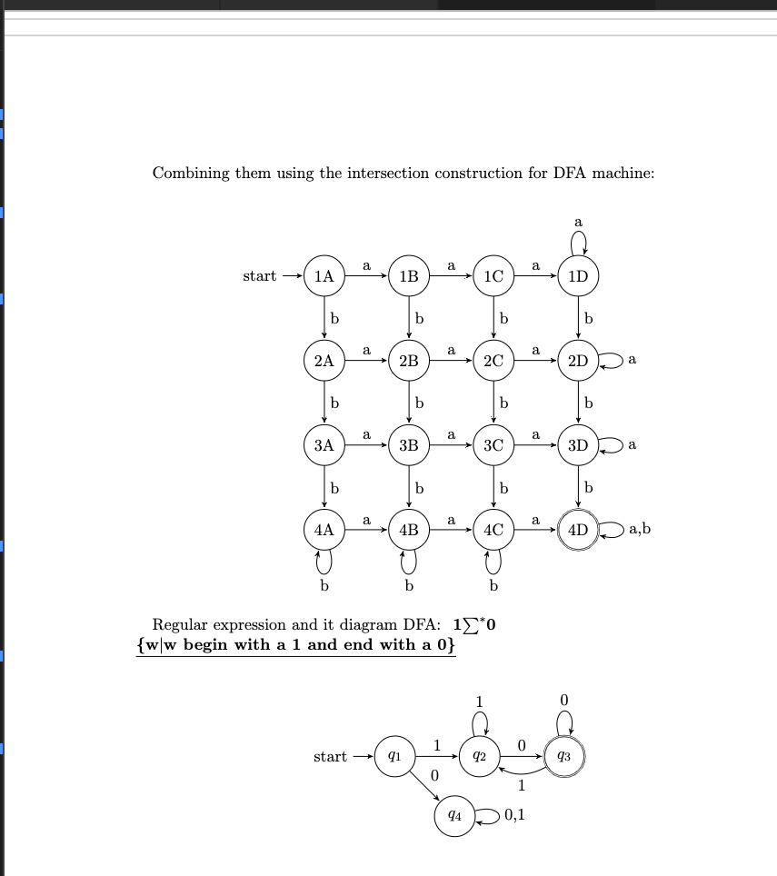
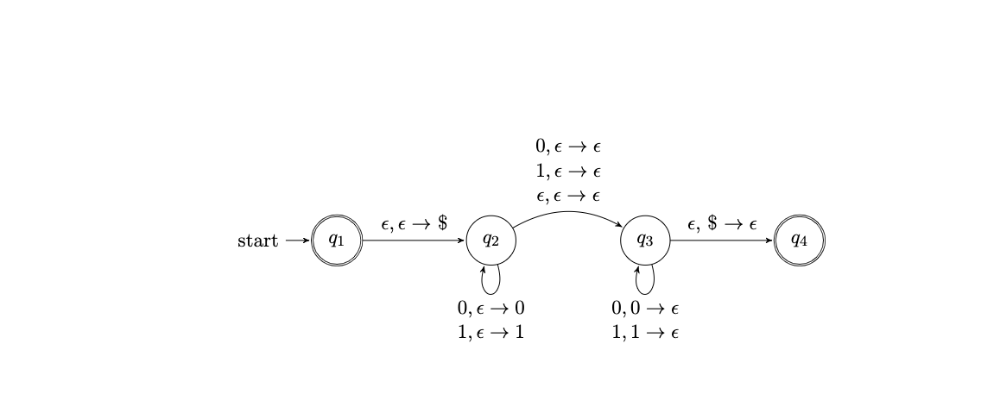
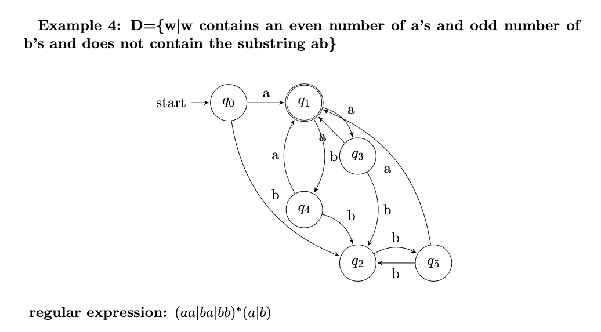
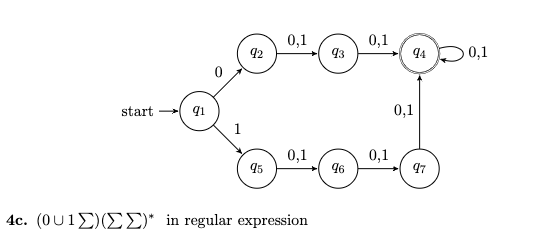
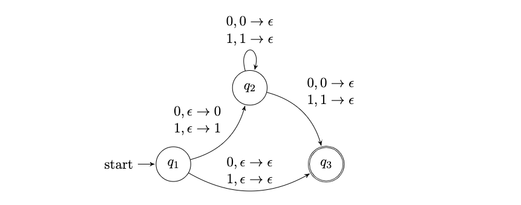
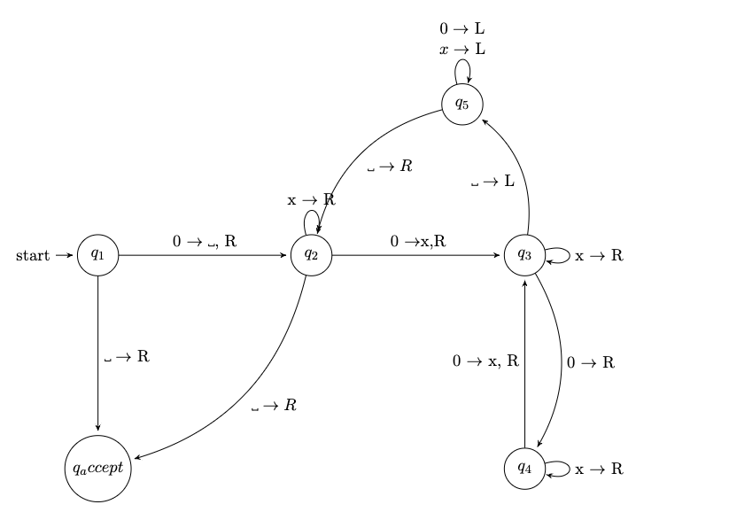
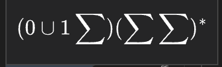

# Latex editor

- Create math function and NFA by using Latex.

## Features:

- Create table, pictorial diagram.
- Create math function in LateX.
- Create dfa and nfa machine.
- Regular expression and its DFA diagram.
- Palindrome diagram.
- Pictorial for regular expression: (aa|ba|bb)∗(a|b)
-  in regular expression
- M machine start and end the same symbol
- Added at least three 0's pictorial
- Added the length of w is odd and its middle symbol is 0's
- Modify machine recognize even number of 0s.
## Set up:
- `brew install --cask mactex`

## Technologies used:
- `LaTex`

