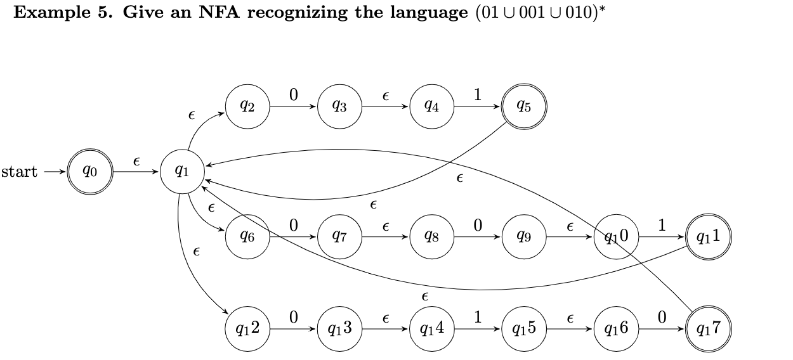
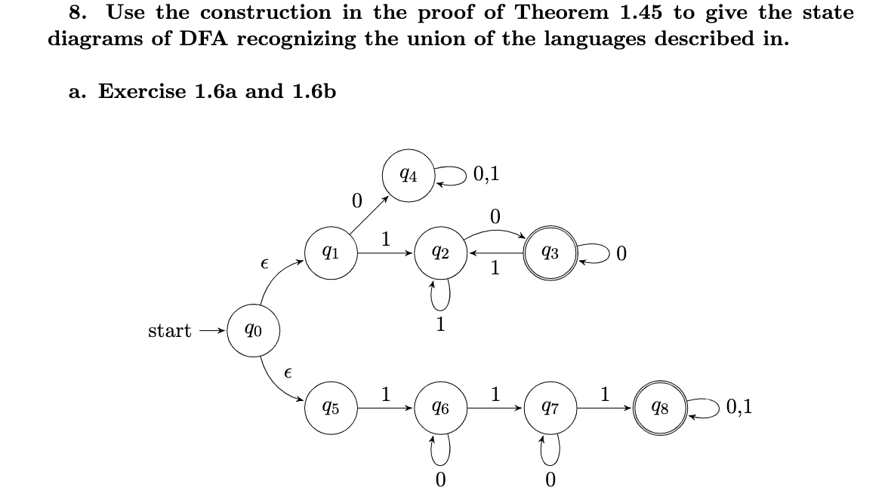
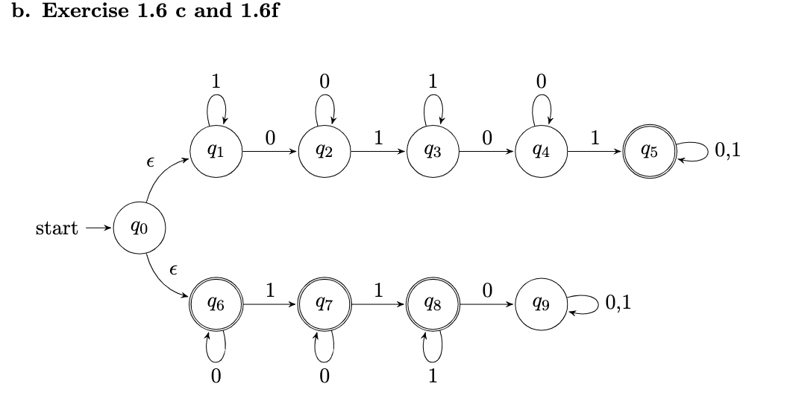
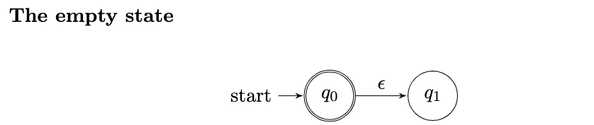
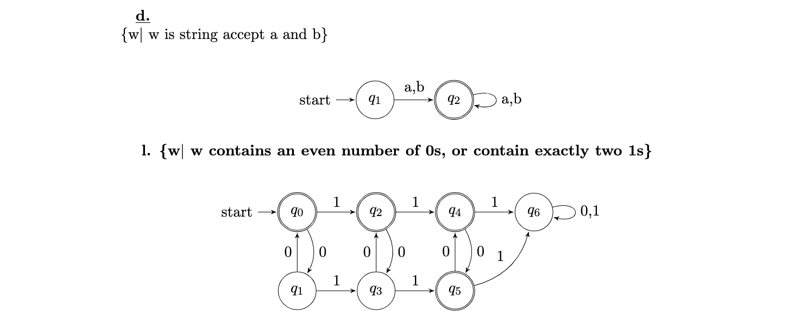
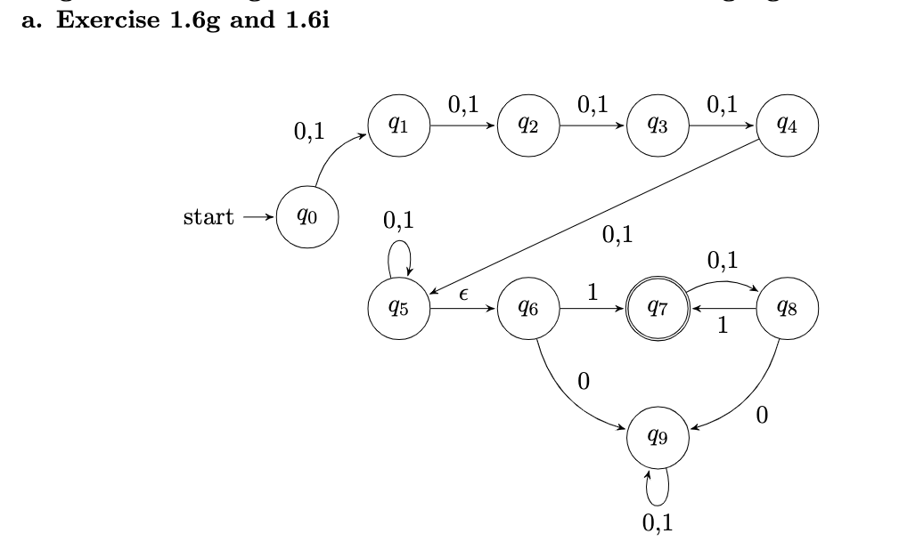

# Latex editor

- Created math function, NFA and DFA by using Latex.

## Features:

- Create table, pictorial diagram.
- Create math function in LateX.
- Create dfa and nfa machine.
- Regular expression and its DFA diagram.
- Palindrome diagram.
- Pictorial for regular expression: (aa|ba|bb)∗(a|b)
-  in regular expression
- M machine start and end the same symbol
- Added at least three 0's pictorial
- Added the length of w is odd and its middle symbol is 0's
- Modify machine recognize even number of 0s.
- DFA start with A and has most B.
- Define machine M3 with odd's number a's and end with a|b.
- Convert NFA to DFA.
- DFA any string except 11 and 111.
- DFA recognize union language ((8a, 8b, 8d, 8l)).
- NFA concatenation language describe in 1.6 a,1.6 b.
- NFA ex9a
## Set up:
- `brew install --cask mactex`

## Technologies used:
- `LaTex`

